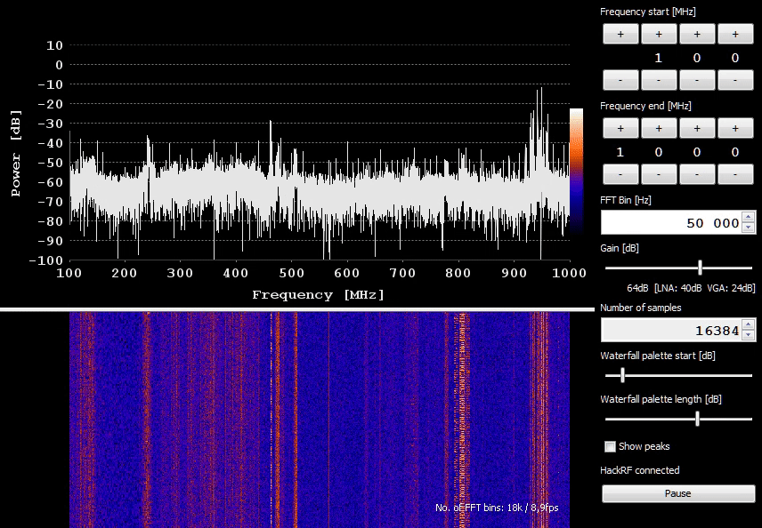

# Spectrum Analyzer GUI for hackrf_sweep for Windows/Linux

### Download:
Windows: [Download the latest version](https://github.com/pavsa/hackrf-spectrum-analyzer/releases)  
Linux: read Installation section below

### Features:
- Optimized for only one purpose - to use HackRF as a spectrum analyzer
- All changes in settings restart hackrf_sweep automatically 
- Easy retuning    
- Peak / Persistent display
- Frequency allocation bands for EU / USA(partial)
- High resolution waterfall plot
- Spur filter - removes spur artifacts from the spectrum 
- hackrf_sweep integrated as a shared library

### Requirements:
* HackRF One with [Firmware 2017.02.1](https://github.com/mossmann/hackrf/releases/tag/v2017.02.1) or newer (use linux inside virtual machine to [update the firmware](https://github.com/mossmann/hackrf/wiki/Updating-Firmware)) 

### Installation:
Make sure HackRF is using at least the minimum firmware version (see above) 

Windows:  
1. Windows 7+ x64 required 
1. Install Java JRE 64bit v1.8+
1. [Download the latest version of Spectrum Analyzer](https://github.com/pavsa/hackrf-spectrum-analyzer/releases) and unzip
1. Install HackRF as a libusb device
  1. [Download Zadig](src/hackrf-sweep/lib/zadig_2.2.exe) and run
  2. Goto Options and check List All Devices
  3. Find "HackRF One" and select Driver "WinUSB" and click install
1. Install (if you don't have one installed) [Java JRE for Windows x64](http://www.oracle.com/technetwork/java/javase/downloads/jre8-downloads-2133155.html) 
1. Run "hackrf_sweep_spectrum_analyzer_windows.cmd"

Linux:  
  
1. To run, ensure these packages are installed (exact name depends on distro):  
`libusb-1.0 libfftw3 default-jdk`   
1. Newer openjdk might work also, not tested. On Ubuntu 18.04:  
`sudo apt install libusb-1.0 libfftw3-bin default-jdk`  
1. Follow the [HackRF USB permissions setup](https://github.com/mossmann/hackrf/wiki/FAQ) - you have to add rules to udev to allow hackrf library to open the HackRF USB device, it does not work by default.    

If something does not work, you can try to build it manually.

### Building  
Building native libraries for Windows (using mingw-w64) and linux is done in one unified build using Ubuntu 18.04 x64.  
1. You'll need to install these packages:  
`sudo apt install build-essential ant git libusb-1.0 libfftw3-bin libfftw3-dev default-jdk mingw-w64`
1. `git clone --depth=1 https://github.com/pavsa/hackrf-spectrum-analyzer.git` 
1. `cd hackrf-spectrum-analyzer/src/hackrf-sweep/`
1. `make`
1. To run, simply execute: `build/hackrf_sweep_spectrum_analyzer_linux.sh`

### Known issues:
* Spectrum updates stop on parameter change
  * Solution: press reset button on the HackRF (firmware bug)

### License:
GPL v3 
